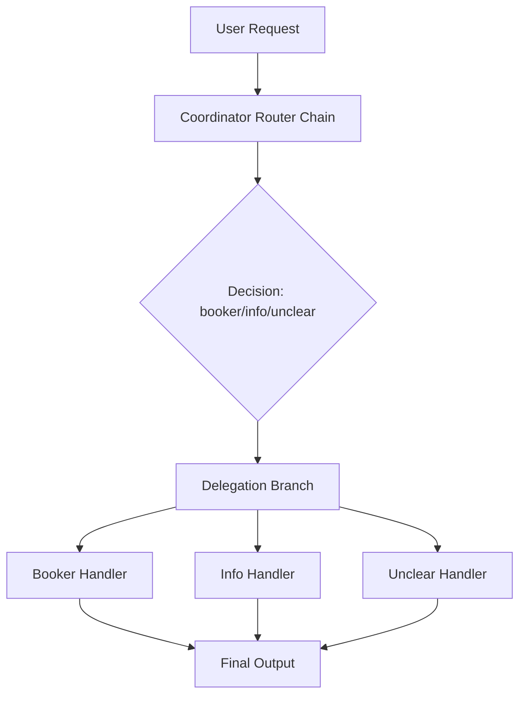
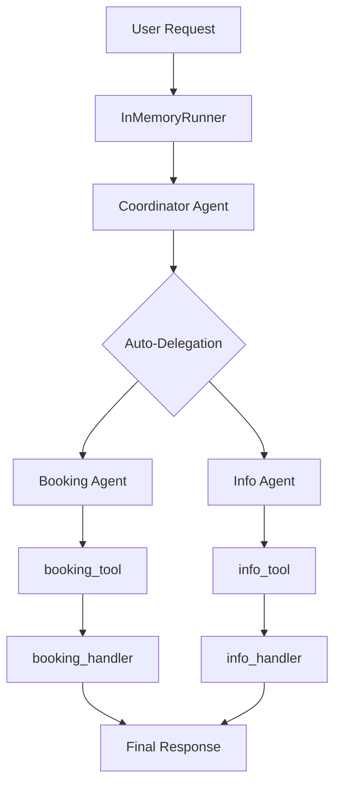

# Routing Pattern

This directory demonstrates a sophisticated routing pattern implementation using LangChain Runnables. The pattern enables intelligent delegation of user requests to specialized handlers based on request analysis.

## Running the scripts

```sh
cd 2-routing-pattern
uv run routing-langchain.py --verbose
uv run adk.py --verbose
```

## LangChain Script Overview

The routing system consists of three main components that work together to analyze, route, and process user requests:



## Component Deep Dive

### 1. Coordinator Router Chain

**Purpose**: Analyzes incoming requests and classifies them into categories.

**Structure**:
```python
coordinator_router_chain = coordinator_router_prompt | llm | StrOutputParser()
```

**Data Flow**:
```
Input: {"request": "Book me a flight to London"}
      ↓
Prompt Template (formats request)
      ↓
LLM (Gemini) → classifies request
      ↓
String Parser → extracts decision
      ↓
Output: "booker"
```

### 2. Branches Dictionary

**Purpose**: Defines the available handlers and their processing logic.

**Structure**:
```python
branches = {
    "booker": RunnablePassthrough.assign(
        output=lambda x: booking_handler(x["request"]["request"])
    ),
    "info": RunnablePassthrough.assign(
        output=lambda x: info_handler(x["request"]["request"])
    ),
    "unclear": RunnablePassthrough.assign(
        output=lambda x: unclear_handler(x["request"]["request"])
    ),
}
```

**Key Insight**: Each branch uses `RunnablePassthrough.assign()` which:
- Preserves all input data (passthrough behavior)
- Adds a new "output" key containing the handler's result
- Uses nested access `x["request"]["request"]` to extract the original user request

### 3. Delegation Branch

**Purpose**: Routes requests to appropriate handlers based on the coordinator's decision.

**Structure**:
```python
delegation_branch = RunnableBranch(
    (lambda x: x["decision"].strip() == "booker", branches["booker"]),
    (lambda x: x["decision"].strip() == "info", branches["info"]),
    branches["unclear"],  # Default fallback
)
```

**Routing Logic**:
- Each condition is a tuple: `(condition_function, target_runnable)`
- Conditions are evaluated in order
- First matching condition triggers its associated branch
- Last parameter (without condition) serves as default fallback

### 4. Coordinator Agent (Master Chain)

**Purpose**: Orchestrates the entire routing and processing workflow.

**Structure**:
```python
coordinator_agent = (
    {"decision": coordinator_router_chain, "request": RunnablePassthrough()}
    | delegation_branch
    | (lambda x: x["output"])
)
```

## Data Flow Analysis

Let's trace a complete request through the system:

### Step 1: Input Preparation
```
Input: {"request": "Book me a flight to London"}
      ↓
Parallel Processing:
├─ decision: coordinator_router_chain → "booker"
└─ request: RunnablePassthrough() → {"request": "Book me a flight to London"}
      ↓
Combined: {
    "decision": "booker",
    "request": {"request": "Book me a flight to London"}
}
```

### Step 2: Delegation Branch Processing
```
Input: {
    "decision": "booker",
    "request": {"request": "Book me a flight to London"}
}
      ↓
Condition Check: x["decision"].strip() == "booker" → True
      ↓
Route to: branches["booker"]
      ↓
RunnablePassthrough.assign(
    output=lambda x: booking_handler(x["request"]["request"])
)
      ↓
Result: {
    "decision": "booker",
    "request": {"request": "Book me a flight to London"},
    "output": "Booking handler processed request: Book me a flight to London. Result: Simulated booking action."
}
```

### Step 3: Output Extraction
```
Input: {
    "decision": "booker",
    "request": {"request": "Book me a flight to London"},
    "output": "Booking handler processed request: ..."
}
      ↓
Extract: lambda x: x["output"]
      ↓
Final Output: "Booking handler processed request: Book me a flight to London. Result: Simulated booking action."
```

## Key Design Patterns

### 1. **Parallel Processing with RunnableParallel**
The coordinator agent uses implicit parallel processing to simultaneously:
- Analyze the request (coordinator_router_chain)
- Preserve the original request (RunnablePassthrough)

### 2. **Conditional Routing with RunnableBranch**
The delegation_branch implements clean conditional logic without complex if/else statements.

### 3. **Data Preservation with RunnablePassthrough**
Each handler preserves all input data while adding new computed values, enabling downstream components to access both original and processed data.

### 4. **Functional Composition**
The entire system is built using function composition (`|` operator), making it:
- Readable and declarative
- Easily testable
- Modular and extensible

## Extension Points

To add new handlers:

1. **Create Handler Function**:
```python
def new_handler(request: str) -> str:
    return f"New handler processed: {request}"
```

2. **Add to Branches**:
```python
branches["new_type"] = RunnablePassthrough.assign(
    output=lambda x: new_handler(x["request"]["request"])
)
```

3. **Update Router Prompt**:
```python
# Add new classification logic to coordinator_router_prompt
```

4. **Add Condition to Delegation Branch**:
```python
delegation_branch = RunnableBranch(
    (lambda x: x["decision"].strip() == "booker", branches["booker"]),
    (lambda x: x["decision"].strip() == "info", branches["info"]),
    (lambda x: x["decision"].strip() == "new_type", branches["new_type"]),
    branches["unclear"],
)
```

## Runnables in LangChain

LangChain Runnables are the core abstraction for creating composable, chainable components. They provide a unified interface for connecting different AI operations together.

**Key concepts:**
- **Uniform Interface**: Every Runnable has `.invoke()`, `.stream()`, `.batch()`, and `.ainvoke()` methods
- **Composability**: Chain Runnables together with the `|` operator
- **Flexibility**: Mix prompts, models, parsers, retrievers, and custom functions seamlessly

**Architecture role:**
```python
# Everything is a Runnable
prompt = ChatPromptTemplate(...)        # Runnable
model = ChatOpenAI(...)                 # Runnable
parser = StrOutputParser()              # Runnable
retriever = vectorstore.as_retriever()  # Runnable

# Chain them together
chain = prompt | model | parser
```

**Benefits:**
1. **Standardization**: Same interface regardless of component type
2. **Streaming**: Built-in support for streaming responses
3. **Parallelization**: Automatic parallel execution where possible
4. **Error handling**: Consistent error propagation
5. **Observability**: Built-in tracing and monitoring hooks

**Common patterns:**
- RAG: `retriever | prompt | model | parser`
- Multi-step: `step1 | step2 | step3`
- Branching: `RunnableBranch` for conditional logic
- Parallel: `RunnableParallel` for concurrent operations

Runnables essentially turn LangChain into a functional programming framework for AI workflows, making complex chains readable and maintainable.

## Google ADK Example

The Google Agent Development Kit (ADK) provides a more structured, object-oriented approach to building agent systems with built-in routing capabilities. Unlike LangChain's functional composition, ADK uses a hierarchical agent architecture with automatic delegation.

### Architecture Overview



### Core Components

#### 1. Function Tools

ADK wraps Python functions as tools that agents can invoke:

```python
def booking_handler(request: str) -> str:
    """Handles booking requests for flights and hotels."""
    return f"Booking action for {request} was handled."

# Convert function to ADK tool
booking_tool = FunctionTool(booking_handler)
```

**Key Pattern**: Functions become callable tools that agents can intelligently invoke based on context.

#### 2. Specialized Agents

Agents are created with specific roles, models, and tools:

```python
booking_agent = Agent(
    name="Booker",
    model=os.getenv("GOOGLE_MODEL"),  # "gemini-2.0-flash"
    description="A specialized agent that handles all flight and hotel booking requests",
    tools=[booking_tool],
)
```

**Agent Properties**:
- **name**: Identifier for the agent
- **model**: LLM model to use (Gemini 2.0 Flash)
- **description**: Purpose and capabilities
- **tools**: Available function tools

#### 3. Coordinator Agent (Parent Agent)

The coordinator manages delegation through explicit instructions and sub-agents:

```python
coordinator = Agent(
    name="Coordinator",
    model=os.getenv("GOOGLE_MODEL"),
    instruction="""
     You are the main coordinator. Your only task is to analyze incoming user requests
     and delegate them to the appropriate specialist agent. Do not try to answer the user directly.
     - For any requests related to booking flights or hotels, delegate to the 'Booker' agent.
     - For all other general information questions, delegate to the 'Info' agent.
    """,
    sub_agents=[booking_agent, info_agent],
)
```

**Auto-Flow Delegation**: The coordinator automatically routes requests to sub-agents based on:
- **instruction**: Natural language delegation rules
- **sub_agents**: Available specialist agents
- **Built-in routing logic**: ADK's intelligent delegation system

#### 4. InMemoryRunner

The runner manages agent execution, sessions, and event handling:

```python
runner = InMemoryRunner(coordinator)
```

**Runner Responsibilities**:
- Session management (user_id, session_id)
- Event streaming
- Agent coordination
- Response aggregation

### Execution Flow

#### Step 1: Session Creation
```python
user_id = "user_123"
session_id = str(uuid.uuid4())
await runner.session_service.create_session(
    app_name=runner.app_name, 
    user_id=user_id, 
    session_id=session_id
)
```

#### Step 2: Request Processing
```python
for event in runner.run(
    user_id=user_id,
    session_id=session_id,
    new_message=types.Content(
        role="user", 
        parts=[types.Part(text="Book me a hotel in Paris")]
    ),
):
    # Process streaming events
```

#### Step 3: Event Stream Processing

ADK uses an event-driven architecture:

```
User Message → Coordinator Analysis → Agent Selection → Tool Execution → Response
     ↓              ↓                    ↓              ↓            ↓
   Event          Event                Event          Event       Event
```

**Event Types**:
- **Message events**: User input and agent responses
- **Tool events**: Function calls and results
- **Delegation events**: Agent routing decisions
- **Final events**: Complete responses

### Data Flow Analysis

Let's trace a booking request through the ADK system:

#### Input Processing
```
Request: "Book me a hotel in Paris"
      ↓
types.Content(role="user", parts=[types.Part(text="Book me a hotel in Paris")])
      ↓
InMemoryRunner.run() → Event Stream
```

#### Coordinator Analysis
```
Coordinator receives request
      ↓
Analyzes against instruction:
"For any requests related to booking flights or hotels, delegate to the 'Booker' agent"
      ↓
Decision: Route to booking_agent
```

#### Agent Delegation
```
booking_agent receives delegated request
      ↓
Agent has access to: [booking_tool]
      ↓
Decides to call booking_tool
      ↓
booking_tool.invoke("Book me a hotel in Paris")
      ↓
booking_handler("Book me a hotel in Paris")
      ↓
Returns: "Booking action for Book me a hotel in Paris was handled."
```

#### Response Flow
```
Tool result → Agent response → Coordinator → Final event → User
```

### Key Differences from LangChain

| Aspect | LangChain | Google ADK |
|--------|-----------|------------|
| **Architecture** | Functional composition | Object-oriented agents |
| **Routing** | Explicit RunnableBranch logic | AI-powered auto-delegation |
| **Tools** | Manual chain building | Automatic tool selection |
| **State** | Stateless chains | Session-based with memory |
| **Execution** | Synchronous/async chains | Event-driven streaming |
| **Delegation** | Programmatic routing | Natural language instructions |

### Auto-Flow vs Manual Routing

**ADK Auto-Flow Advantages**:
```python
# Simple instruction-based routing
instruction = """
- For booking requests → Booker agent
- For info requests → Info agent
"""
# ADK handles the routing logic automatically
```

**LangChain Manual Routing**:
```python
# Explicit routing logic required
delegation_branch = RunnableBranch(
    (lambda x: x["decision"] == "booker", branches["booker"]),
    (lambda x: x["decision"] == "info", branches["info"]),
    branches["unclear"]
)
```

### Event-Driven Execution

ADK's event system provides fine-grained control:

```python
for event in runner.run(...):
    if event.is_final_response():
        # Handle final response
        final_result = extract_text(event.content)
    elif event.type == "tool_call":
        # Monitor tool usage
        logger.debug(f"Tool called: {event.tool_name}")
    elif event.type == "delegation":
        # Track agent routing
        logger.debug(f"Delegated to: {event.target_agent}")
```

### Session Management

ADK maintains conversation context:

```python
# Each conversation has a unique session
session_id = str(uuid.uuid4())
await runner.session_service.create_session(
    app_name=runner.app_name,
    user_id="user_123", 
    session_id=session_id
)

# Multiple messages in same session maintain context
await run_coordinator(runner, "Book a hotel")
await run_coordinator(runner, "Make it for next week")  # Context preserved
```

### Error Handling

ADK provides structured error handling:

```python
try:
    for event in runner.run(...):
        # Process events
        pass
except Exception as e:
    logger.error(f"Agent execution failed: {e}")
    return f"Error: {e}"
```

### Extension Patterns

#### Adding New Agents
```python
# 1. Create handler function
def translation_handler(request: str) -> str:
    return f"Translated: {request}"

# 2. Create tool
translation_tool = FunctionTool(translation_handler)

# 3. Create agent
translation_agent = Agent(
    name="Translator",
    model=os.getenv("GOOGLE_MODEL"),
    description="Translates text between languages",
    tools=[translation_tool],
)

# 4. Add to coordinator
coordinator = Agent(
    name="Coordinator",
    instruction="""
    - For booking → Booker agent
    - For translation → Translator agent  
    - For other info → Info agent
    """,
    sub_agents=[booking_agent, translation_agent, info_agent],
)
```

#### Custom Tools
```python
from google.adk.tools import FunctionTool

def weather_lookup(location: str) -> str:
    # Custom weather API integration
    return f"Weather in {location}: Sunny, 72°F"

weather_tool = FunctionTool(weather_lookup)
```

### Best Practices

1. **Clear Agent Roles**: Each agent should have a specific, well-defined purpose
2. **Descriptive Instructions**: Coordinator instructions should be clear and unambiguous
3. **Tool Granularity**: Create focused tools that do one thing well
4. **Error Handling**: Always wrap agent execution in try-catch blocks
5. **Session Management**: Use unique session IDs for different conversations
6. **Logging**: Log agent decisions and tool usage for debugging

### When to Use ADK vs LangChain

**Use Google ADK when**:
- You want AI-powered routing without manual logic
- You need session-based conversations
- You prefer object-oriented agent architecture
- You want built-in Google Cloud integration
- You need event-driven processing

**Use LangChain when**:
- You want explicit control over routing logic
- You prefer functional programming patterns
- You need broad ecosystem compatibility
- You want framework-agnostic solutions
- You need custom retrieval patterns

Both approaches solve the routing pattern but with different philosophies: ADK emphasizes AI-powered automation while LangChain emphasizes explicit, controllable composition.
