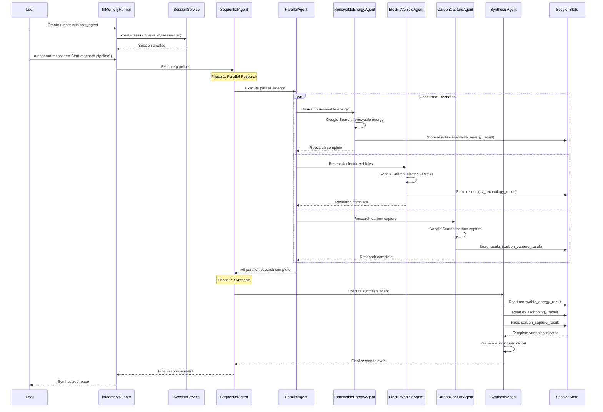

# Parallelization

## LangChain

A key element of LangChain is `ainvoke` within the `async def` function.
In this specific script, `full_parallel_chain.ainvoke(topic)` triggers the parallel execution of `summarize_chain`, `questions_chain`, and `terms_chain` with the provided `topic`, and then synthesizes their outputs.

Per Gemini:

> `ainvoke` is a method used to **asynchronously** execute a LangChain "runnable" (in this case, `full_parallel_chain`).
>
> The `a` prefix in `ainvoke` stands for "asynchronous".
This means it's a non-blocking call that is awaited, allowing other tasks to run while the chain is being executed.
It's the asynchronous equivalent of the `invoke` method.

### Logging

I wanted to see what each of the Runnables was doing and Gemini proposed adding a RunnableLambda function to the LangChain chain:


```py
# These three chains each represent distinct tasks that can be executed in parallel

def log_runnable(label: str) -> RunnableLambda:
    """Returns a RunnableLambda that logs the input with a given label and passes it through."""
    return RunnableLambda(lambda x: logger.info(f"Runnable '{label}' output: {x}") or x)


summarize_chain: Runnable = (
    ChatPromptTemplate.from_messages(
        [("system", "Summarize the following text concisely:"), ("user", "{topic}")]
    | llm
    | StrOutputParser()
    | log_runnable("Summary")
)

questions_chain: Runnable = (
    | llm
    | StrOutputParser()
    | log_runnable("Questions")
)

terms_chain: Runnable = (
    | llm
    | StrOutputParser()
    | log_runnable("Key Terms")
)
```

### How to Run

To run the script, use `uv run`:

```bash
uv run langchain-parallel.py
```

This will run the script with the default topic ("The history and future of space exploration").

#### Options

You can also provide a custom topic using the `--topic` flag:

```bash
uv run langchain-parallel.py --topic "The impact of AI on software development"
```

To see verbose output, including the output from each parallel chain, use the `--verbose` flag:

```bash
uv run langchain-parallel.py --topic "The impact of AI on software development" --verbose
```

## Google ADK Example

I was getting stuck trying to implement the `runner.run_async()` method.
Turns out that `runner.run()` is the right approach, but that must happen in a `session` context, while cycling through (and yielding) each of the child events.

Here's the general pattern:

```py
runner = InMemoryRunner(root_agent)
await runner.session_service.create_session(app_name=runner.app_name, user_id=user_id, session_id=session_id)
for event in runner.run(user_id=user_id, session_id=session_id, new_message=content):
    if event.is_final_response() and event.content:
        # Handle the final response
        break
```

### Sequence Diagram

Here's how the Google ADK pipeline executes:



### ADK events

ADK events are the fundamental communication method between agents and the runner.
The runner can yield multiple types of event during execution:

1. Input Event**: Your initial message enters the system
2. **Agent Start Events**: Sequential agent begins, parallel agents start
3. **Tool Call Events**: Research agents call Google Search
4. **State Update Events**: Research results stored in session state
5. **Agent Completion Events**: Parallel agents finish
6. **Merger Agent Events**: Synthesis agent accesses state, generates report
7. **Final Response Event**: Complete synthesized response ready

In my example we're checking that we have the `event.is_final_response()` and that the final event has `event.content` before handling the final response.
We're ignoring most of the back and forth communication between agents and the runner, focusing on the final interaction.

### Event Content Parts

The code to cycle through `event.content.parts` was confusing to me until I realized that Gemini is multi-modal.
The `event.content.parts` structure exists because Google's ADK is built on top of the Gemini API, which supports **multimodal content** - not just text.

A single response can contain different types of content:

**Text + Images**:
```python
parts = [
    Part(text="Here's the analysis:"),
    Part(inline_data=ImageData(...)),  # An image
    Part(text="As you can see in the chart above...")
]
```

**Code + Explanation**:

```python
parts = [
    Part(text="Here's the solution:"),
    Part(text="```python\ndef solve():\n    return 42\n```"),
    Part(text="This function returns the answer.")
]
```

**Function Calls + Results**:

```python
parts = [
    Part(function_call=FunctionCall(name="search", args={"query": "AI"})),
    Part(function_response=FunctionResponse(response={"results": "..."})),
    Part(text="Based on the search results...")
]
```

For your text-only research pipeline, you'll typically get:

```python
parts = [
    Part(text="## Summary of Recent Sustainable Technology advancements\n\n...")
]
```

So `event.content.parts[0].text` contains your full synthesis report.

Even in text-only responses, the LLM might generate multiple text parts for:
- **Streaming**: Each chunk arrives as a separate part
- **Template processing**: Different sections processed separately
- **Internal structuring**: ADK might split long responses

The `"".join(text_parts)` ensures you get the complete message regardless of how it's internally structured.

This defensive approach ensures your code works whether the response is simple text or complex multimodal content.
