# Reflection Pattern

## Concept

Reflection in the sense of self-reflection and self-improvement.

> Unlike a simple sequential chain where output is passed directly to the next step, or routing which chooses a path, reflection introduces a feedback loop. The agent doesn't just produce an output; it then examines that output (or the process that generated it), identifies potential issues or areas for improvement, and uses those insights to generate a better version or modify its future actions.
>
> Antonio Gulli. A Hands-On Guide to Building Intelligent Systems

Whether it's a separate agent doing the reflection or not, the overall system has a 'meta' benefit:

> Reflection adds a layer of meta-cognition to agentic systems, enabling them to learn from their own outputs and processes, leading to more intelligent, reliable, and high-quality results.
>
> Antonio Gulli. A Hands-On Guide to Building Intelligent Systems

## Reflection Pattern Diagram

Gulli talks about Producer-Consumer or Generator-Critic being a common implementation of the reflection pattern.
It avoids cognitive bias as separate agents with their own system prompts tend to product better results.

```mermaid
graph TD
    User[👤 User] --> Prompt[✨ Prompt]
    Prompt --> Producer[🤖 Agent: Producer]
    Producer --> Output[📄 Output]
    Producer --> Critique[🤖 Agent: Critique]

    Critique -->|Reflection| Producer
    Output --> User

    style Prompt fill:#f9f9f9
    style Producer fill:#e1f5fe
    style Critique fill:#e1f5fe
    style Output fill:#f3e5f5
    style User fill:#e8f5e8
```

