# Tool Use

LLMs are stuck in time.
Tool Use is the way to connect them to more current or specialized knowledge such as recent events or confidential organizational information.

Until recently this was mostly 'function calling' but now think in terms of generic 'tool calling'.

## Tool Use Design Pattern

```mermaid
flowchart TD
    User[👤 User] --> Prompt[✨ Prompt]
    Prompt --> Agent[🧠 Agent]
    Agent <--> Tools[🔧 Tools]
    Agent --> Output[📄 Output]
    Output --> User

    style User fill:#e1f5fe
    style Agent fill:#f3e5f5
    style Tools fill:#fff3e0
    style Output fill:#e8f5e8
```



Most of the chapter described non-Model Context Protocol (MCP) ways of wiring up tools.
I think there's a section on MCP coming up, but MCP was probably just coming into being when the draft book was written.
Still, handy to know how to do things without MCP :smile:

## Frameworks

LangChain uses the `@tool` decorator to define tools that can be used by the agent. `create_tool_calling_agent` and AgentExecutor are used to build tool-using agents.

Google ADK includes some handy pre-built tools such as Google Search and Code Execution.

## LangChain Notes

I didn't understand why `agent_scratchpad` was needed and whether the specific name was important.
Some Claude searching led to this:

> `agent_scratchpad` is a special variable in LangChain's ChatPromptTemplate used for agent workflows. It's where the agent stores its intermediate reasoning steps, tool calls, and tool outputs as it works toward a final answer.
>
>Key points:
>
> 1. **Purpose**: Acts as the agent's "working memory" containing the conversation history between the agent and tools
> 2. **Format**: A list of alternating AI messages (tool calls) and tool messages (tool outputs)
> 3. **Usage**: Must be included as a placeholder in your prompt template
>
> Example:
> ```python
> from langchain_core.prompts import ChatPromptTemplate, MessagesPlaceholder
>
> prompt = ChatPromptTemplate.from_messages([
>     ("system", "You are a helpful assistant"),
>     ("user", "{input}"),
>    MessagesPlaceholder(variable_name="agent_scratchpad"),
> ])
> ```
>
> The scratchpad gets populated automatically by the AgentExecutor with the agent's tool usage history, allowing the LLM to see what actions it has already taken and their results.

That seems pretty odd: why isn't it just set up by the ChatPromptTemplate constructor instead of relying on the user to know about that magic variable?

### Nested Event Loops

I didn't understand what the `nest_asyncio` was for. Claude to the rescue!

`nest_asyncio.apply()` patches asyncio to allow nested event loops.

**The Problem**: By default, asyncio prevents running `asyncio.run()` or `loop.run_until_complete()` when an event loop is already running (raises `RuntimeError: This event loop is already running`).

**The Solution**: `nest_asyncio.apply()` removes this restriction by making the event loop reentrant.

**Common Use Cases**:
- Jupyter notebooks (which run their own event loop)
- Web servers
- GUI applications
- When calling async functions from sync code in environments with existing event loops

**Usage**:
```python
import nest_asyncio
nest_asyncio.apply()  # Patch applied globally

# Now you can use asyncio.run() even within existing event loops
```

**Caution**: This breaks asyncio's design principles and can cause task starvation if nested runs take too long, as outer tasks won't get execution time.

### Goofs

The script I wrote was originally called `langchain.py`.
After a bunch of head scratching and failed attempts, I realized that
the name conflicted with the `langchain` package :facepalm:
The file was renamed to `tool_agent.py` and the problem was solved.

I also forgot to annotate the `def search_information` function with the `@tool` decorator.
